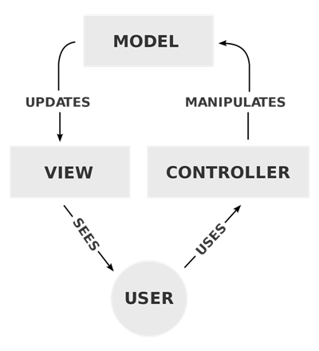

<!-- PROJECT SHIELDS -->
<!--
*** I'm using markdown "reference style" links for readability.
*** Reference links are enclosed in brackets [ ] instead of parentheses ( ).
*** See the bottom of this document for the declaration of the reference variables
*** for contributors-url, forks-url, etc. This is an optional, concise syntax you may use.
*** https://www.markdownguide.org/basic-syntax/#reference-style-links
-->
[![Contributors][contributors-shield]][contributors-url]
[![Forks][forks-shield]][forks-url]
[![Stargazers][stars-shield]][stars-url]
[![Issues][issues-shield]][issues-url]


<!-- PROJECT LOGO -->
<br />

<p align="center">
  <a href="https://github.com/martian1431/camagru">
    
  </a>
  <h3 align="center">Camagru Documentation</h3>
  <p align="center">
    <a href="https://github.com/martian1431/camagru">View Demo</a>
    ·
    <a href="https://github.com/martian1431/camagru/issues">Report Bug</a>
    ·
    <a href="https://github.com/martian1431/camagru/issues">Request Feature</a>
  </p>
</p>

<!-- TABLE OF CONTENTS -->
<details>
  <summary>Table of Contents</summary>
  <ol>
    <li>
      <a href="#about-the-project">About The Project</a>
      <ul>
        <li><a href="#built-with">Built With</a></li>
      </ul>
    </li>
    <li>
      <a href="#getting-started">Getting Started</a>
      <ul>
        <li><a href="#prerequisites">Prerequisites</a></li>
        <li><a href="#installation">Installation</a></li>
      </ul>
    </li>
    <li><a href="#architecture">Architecture</a></li>
    <li><a href="#tests">Tests</a></li>
    <li><a href="#roadmap">Roadmap</a></li>
    <li><a href="#contributing">Contributing</a></li>
    <li><a href="#license">License</a></li>
    <li><a href="#contact">Contact</a></li>
    <li><a href="#acknowledgements">Acknowledgements</a></li>
  </ol>
</details>


<!-- ABOUT THE PROJECT -->
## About The Project

<!-- [![Product Name Screen Shot][product-screenshot]](https://example.com) -->

This is a small web application allowing users to upload a basic photo or use a webcam to take a photo.

### Built With [XAMPP](https://www.apachefriends.org/index.html)

XAMPP is a free and open-source cross-platform web server solution stack package developed by Apache Friends, 
consisting mainly of the Apache HTTP Server, Mysql database, and interpreters for scripts written in the PHP 
and Perl programming languages. 

###### *Tools and Languages:*
* [Apache HTTP server](https://httpd.apache.org/)
* [Send Mail]()
* [PHP](https://www.php.net/)
* [Mysql](https://www.mysql.com/)
* [HTML](https://developer.mozilla.org/en-US/docs/Web/HTML)
* [CSS](https://www.w3.org/Style/CSS/Overview.en.html)
* [Bootstrap](https://getbootstrap.com)
* [Javascript](https://www.javascript.com/)

<!-- Architecture -->
## Architecture
 Model–view–controller is a software design pattern commonly used for developing 
 User interface that divides the related program logic into three interconnected elements. 
 This is done to separate internal representations of information from the ways 
 information is presented to and accepted from the user.
 
 <p align="center">
    
 </p>
 
##### *Controller*
Controllers act as an interface between Model and View components to process all the business logic 
and incoming requests, manipulate data using the Model component and interact with the Views to render 
the final output. For example, the Customer controller will handle all the interactions and inputs 
from the Customer View and update the database using the Customer Model. The same controller will be 
used to view the Customer data.
 
 ##### *Model*
  The Model component corresponds to all the data-related logic that the user works with. 
  This can represent either the data that is being transferred between the View and Controller 
  components or any other business logic-related data. For example, a Customer object will 
  retrieve the customer information from the database, manipulate it and update it data back 
  to the database or use it to render data.
  
  ##### *View*
  The View component is used for all the UI logic of the application. For example, the User view 
  will include all the UI components such as forms, dropdowns, etc. that the final user interacts with.


<!-- GETTING STARTED -->
## Getting Started

To run this application you need to follow the instruction below 

### Prerequisites
  <ol>
    <li>Download and install <a href=""> XAMPP </a></li>
        <li>
            Configure your Mysql to use these default credentials
            <ul>
                <li>Username: root</li>
                <li>Password: password</li>
            </ul>
        </li>
    <li>
        Enable send mail function using PHP.ini file. Add or Edit the following line
        <ul>
            <li>
                sendmail_path = "\"C:\xampp\sendmail\sendmail.exe\" -t"
            </li>
        </ul>
    </li>
    <li>
        Configure sendmail. Add or Edit the following lines
        <ul>
            <li>
                smtp_server = smtp.gmail.com
            </li>
            <li>
                smtp_port = 587
            </li>
            <li>
                auth_username = example@domain.com
            </li>
            <li>
                auth_password = password
            </li>
        </ul>
    </li>
  </ol>


> **_NOTE:_**  
>If you using google to configure send mail plugin you need to enable "Less secure app access" on google under security https://myaccount.google.com/security


### Installation

1. Using your terminal cd into htdocs directory
    ```sh
   $ cd "C:/xampp/htdocs"
   ```
2. Clone the repo
   ```sh
   git clone https://github.com/martian1431/camagru.git
   ```
3. Start Apache and Mysql servers
4. Open browser and Go to url http://localhost/camagru, this will create a database and tables.

<!-- USAGE EXAMPLES -->
## Tests

Use this space to show useful examples of how a project can be used. Additional screenshots, code examples and demos work well in this space. You may also link to more resources.

  <ul>
    <li>
        The application should allow a user to sign up by asking at least a valid email address,
        an username and a password.
    </li>
    <li>
        At the end of the registration process, an user should confirm his account via a unique 
        link sent at the email address used in the registration form.
    </li>
    <li>
        The user should then be able to connect to the application, using their username and 
        password, and also should be able to tell the application to send a password reinitialisation 
        mail, if he forget his password.
    </li>
    <li>
        The user should be able to disconnect in one click at any time on any page.
    </li>
    <li>
        Once connected, an user should modify his username, mail address or password.
    </li>
    <li>
        Gallery is public and must display all the images edited by all the users, It should also 
        allow (only) a connected user to like them and/or comment them.
    </li>
    <li>
        The list of images must be paginated, with at least 5 elements per page
    </li>
    <li>
        When an image receives a new comment, the author of the image should be notified by email. 
        This preference must be set as true by default but can be deactivated in user’s preferences.
    </li>
    <li>
        Capture image with webcam and add sticker before saving.
    </li>
    <li>
        Because not everyone has a webcam, a user should be allowed to upload a image instead of 
        capturing one with the webcam.
    </li>
    <li>
        The user should be able to delete his edited images, but only his, not other users’ creations.
    </li>
  </ul>


<!-- ROADMAP -->
## Roadmap

See the [open issues](https://github.com/martian1431/camagru/issues) for a list of proposed features (and known issues).


<!-- CONTRIBUTING -->
## Contributing

Contributions are what make the open source community such an amazing place to be learn, inspire, and create. Any contributions you make are **greatly appreciated**.

1. Fork the Project
2. Create your Feature Branch (`git checkout -b feature/AmazingFeature`)
3. Commit your Changes (`git commit -m 'Add some AmazingFeature'`)
4. Push to the Branch (`git push origin feature/AmazingFeature`)
5. Open a Pull Request


<!-- LICENSE -->
## License

Distributed under the MIT License. See `LICENSE` for more information.

<!-- ACKNOWLEDGEMENTS -->
## Acknowledgements
* [Curtis Parham](https://bitbucket.org/parhamcurtis/ruahmvcyoutubecourse/src/master/)
* [Ruah MVC YouTube Course](https://www.youtube.com/watch?v=rkaLJrYnpOM&list=PLFPkAJFH7I0keB1qpWk5qVVUYdNLTEUs3&index=1&ab_channel=CurtisParham)

<!--
* [Img Shields](https://shields.io)
* [Choose an Open Source License](https://choosealicense.com)
* [GitHub Pages](https://pages.github.com)
* [Animate.css](https://daneden.github.io/animate.css)
* [Loaders.css](https://connoratherton.com/loaders)
* [Slick Carousel](https://kenwheeler.github.io/slick)
* [Smooth Scroll](https://github.com/cferdinandi/smooth-scroll)
* [Sticky Kit](http://leafo.net/sticky-kit)
* [JVectorMap](http://jvectormap.com)
* [Font Awesome](https://fontawesome.com)
-->


<!-- MARKDOWN LINKS & IMAGES -->
<!-- https://www.markdownguide.org/basic-syntax/#reference-style-links -->
[contributors-shield]: https://img.shields.io/github/contributors/martian1431/camagru.svg?style=for-the-badge
[contributors-url]: https://github.com/martian1431/camagru/graphs/contributors
[forks-shield]: https://img.shields.io/github/forks/martian1431/camagru.svg?style=for-the-badge
[forks-url]: https://github.com/martian1431/camagru/network/members
[stars-shield]: https://img.shields.io/github/stars/martian1431/camagru.svg?style=for-the-badge
[stars-url]: https://github.com/martian1431/camagru/stargazers
[issues-shield]: https://img.shields.io/github/issues/martian1431/camagru.svg?style=for-the-badge
[issues-url]: https://github.com/martian1431/camagru/issues
[license-shield]: https://img.shields.io/github/license/martian1431/camagru.svg?style=for-the-badge
[license-url]: https://github.com/martian1431/camagru/blob/master/LICENSE.txt
[linkedin-shield]: https://img.shields.io/badge/-LinkedIn-black.svg?style=for-the-badge&logo=linkedin&colorB=555
[linkedin-url]: https://linkedin.com/in/othneildrew
[product-screenshot]: images/screenshot.png
[product-screenshot1]: images/screenshot1.png 
[last-commit-shield]: https://img.shields.io/github/contributors/martian1431/camagru.svg?style=for-the-badge
[last-commit-url]: https://github.com/martian1431/camagru/graphs/contributors
